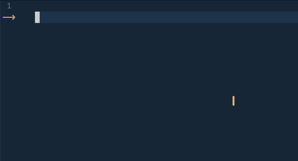

# gpt4all.nvim

Fork of [ChatGPT.nvim](https://github.com/jackMort/ChatGPT.nvim).



> **WARNING**: this is a cut demo. In reality, it took almost 1.5 minutes to generate that code on my laptop.

`gpt4all.nvim` is a Neovim plugin that allows you to interact with [gpt4all](https://github.com/nomic-ai/gpt4all) language model. Unlike ChatGPT, gpt4all is FOSS and does not require remote servers.

## Installation

```lua
-- Packer
use({
  "WhiteBlackGoose/gpt4all.nvim",
    config = function()
      require("chatgpt").setup()
    end,
    requires = {
      "MunifTanjim/nui.nvim",
      "nvim-lua/plenary.nvim",
      "nvim-telescope/telescope.nvim"
    }
})

-- Lazy
{
  "WhiteBlackGoose/gpt4all.nvim",
    event = "VeryLazy",
    config = function()
      require("chatgpt").setup()
    end,
    dependencies = {
      "MunifTanjim/nui.nvim",
      "nvim-lua/plenary.nvim",
      "nvim-telescope/telescope.nvim"
    }
}
```

For configuration [see upstream](https://github.com/jackMort/ChatGPT.nvim/).

## Usage

Plugin exposes following commands:

#### `GPT4ALL`
`ChatGPT` command which opens interactive window using the `gpt-3.5-turbo`
model.

#### `GPT4ALLActAs`
`ChatGPTActAs` command which opens a prompt selection from [Awesome ChatGPT Prompts](https://github.com/f/awesome-chatgpt-prompts) to be used with the `gpt-3.5-turbo` model.


#### `GPT4ALLEditWithInstructions`
`ChatGPTEditWithInstructions` command which opens interactive window to edit selected text or whole window using the `code-davinci-edit-002` model (GPT 3.5 fine-tuned for coding).

You can map it usig the Lua API, e.g. using `which-key.nvim`:
```lua
local chatgpt = require("chatgpt")
wk.register({
    p = {
        name = "ChatGPT",
        e = {
            function()
                chatgpt.edit_with_instructions()
            end,
            "Edit with instructions",
        },
    },
}, {
    prefix = "<leader>",
    mode = "v",
})
```

- [demo video](https://www.youtube.com/watch?v=dWe01EV0q3Q).


#### `GPT4ALLRun`

`ChatGPTRun [action]` command which runs specific actions -- see [`actions.json`](./lua/chatgpt/flows/actions/actions.json) file for a detailed list. Available actions are:
  1. `grammar_correction`
  2. `translate`
  3. `keywords`
  4. `docstring`
  5. `add_tests`
  6. `optimize_code`
  7. `summarize`
  8. `fix_bugs`
  9. `explain_code`
  10. `roxygen_edit`
  11. `code_readability_analysis` -- see [demo](https://youtu.be/zlU3YGGv2zY)

All the above actions are using `gpt-3.5-turbo` model.

It is possible to define custom actions with a JSON file. See [`actions.json`](./lua/chatgpt/flows/actions/actions.json) for an example. The path of custom actions can be set in the config (see `actions_paths` field in the config example above).

An example of custom action may look like this: (`#` marks comments)
```python
{
  "action_name": {
    "type": "chat", # or "completion" or "edit"
    "opts": {
      "template": "A template using possible variable: {{filetype}} (neovim filetype), {{input}} (the selected text) an {{argument}} (provided on the command line)",
      "strategy": "replace", # or "display" or "append" or "edit"
      "params": { # parameters according to the official OpenAI API
        "model": "gpt-3.5-turbo", # or any other model supported by `"type"` in the OpenAI API, use the playground for reference
        "stop": [
          "```" # a string used to stop the model
        ]
      }
    },
    "args": {
      "argument": {
          "type": "strig",
          "optional": "true",
          "default": "some value"
      }
    }
  }
}
```
The `edit` strategy consists in showing the output side by side with the iput and
available for further editing requests.
For now, `edit` strategy is implemented for `chat` type only.

The `display` strategy shows the output in a float window.

`append` and `replace` modify the text directly in the buffer.

### Interactive popup
When using `GPT4ALL` and `GPT4ALLEditWithInstructions`, the following
keybindings are available:
- `<C-Enter>` [Both] to submit.
- `<C-y>` [Both] to copy/yank last answer.
- `<C-o>` [Both] Toggle settings window.
- `<Tab>` [Both] Cycle over windows.
- `<C-m>` [Chat] Cycle over modes (center, stick to right).
- `<C-c>` [Chat] to close chat window.
- `<C-u>` [Chat] scroll up chat window.
- `<C-d>` [Chat] scroll down chat window.
- `<C-k>` [Chat] to copy/yank code from last answer.
- `<C-n>` [Chat] Start new session.
- `<C-d>` [Chat] draft message (create message without submitting it to server)
- `<C-r>` [Chat] switch role (switch between user and assistant role to define a workflow)
- `<C-s>` [Both] Toggle system message window.
- `<C-i>` [Edit Window] use response as input.
- `<C-d>` [Edit Window] view the diff between left and right panes and use diff-mode
  commands

When the setting window is opened (with `<C-o>`), settigs can be modified by
pressing `Enter` on the related config. Settings are saved across sections

[](https://www.buymeacoffee.com/jackMort)
